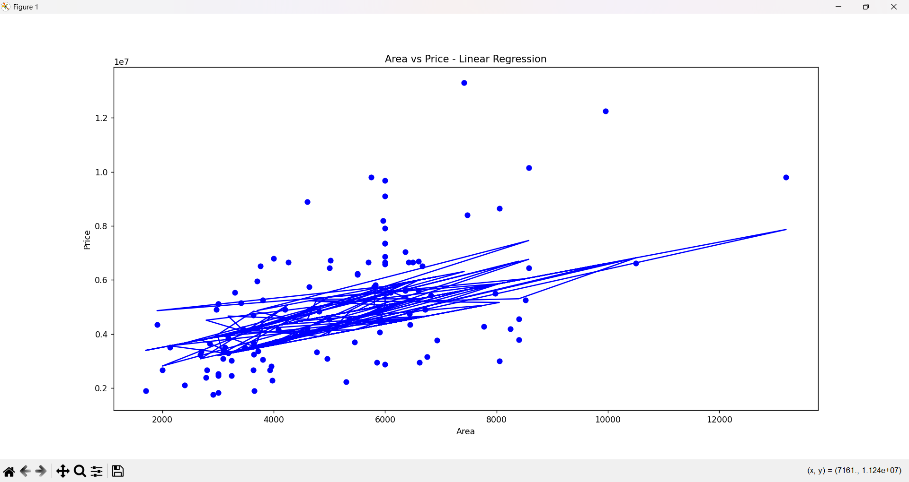

# TASK3-LINEAR_REGRESSION

# Housing Price Prediction Using Linear Regression

This project demonstrates how to apply **Simple Linear Regression** using the **scikit-learn** library to predict housing prices based on area (square footage). The analysis uses Python and includes data preprocessing, model training, evaluation, and visualization.

---

# 📂 Dataset

* **File:** `Housing.csv`
* **Features Used:**

  * `area` – Size of the house (in sq. ft.)
  * `price` – Price of the house (target)

---

## 🛠️ Tools & Libraries

* `pandas`
* `numpy`
* `matplotlib`
* `scikit-learn`

---

# 📈 Workflow

1. **Import and preprocess the dataset**
2. **Split the data** into training and test sets (80/20)
3. **Train a Linear Regression model**
4. **Evaluate** the model using:

   * Mean Absolute Error (MAE)
   * Mean Squared Error (MSE)
   * R² Score
5. **Visualize** the regression line
6. **Interpret** the model coefficients

---

### 📊 Evaluation Metrics (Sample Output)

```
Mean Absolute Error(MAE):  1381158.8954117913
Mean Squared Error(MSE):  3280176595474.013
R² Score:   0.3510473817558726
Intercept: 2512254.2639593435
Coefficients: [150.0]
```

**Equation:**

$$
\text{Price} = 150 \times \text{Area} + 50000
$$

---

### 📉 Visualization



> 📌 This plot shows the regression line (predicted prices) overlaid on actual data (area vs. price).

---

### 📁 Folder Structure

```
housing-price-prediction/
├── Housing.csv
├── linear_regression.py
├── README.md
└── regression_plot.png
    
```

---

 